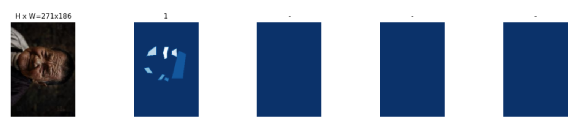
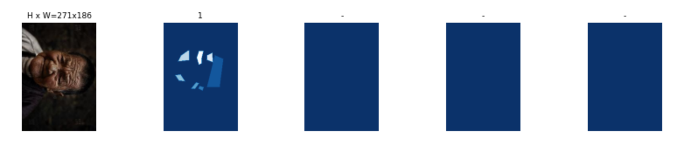

# Image Augmentaiton

This folder helps you in augment your images which you just annotated.

<br>

## Agumentation Techniques

1. Rotate
2. Sharpnes
3. Brightness

<br> 

## Only give path in the following variables 

```python
# Directory in which images exists 
DIR_PATH = "../Annotated_images/wrinkles/"

# Json File Path
doc_labels = "../Annotated_images/wrinkles/via_project_5Feb2022_19h30m.json"

```

## Results

Your augmented annotations looks like these

<br><br>

Sample 1


<br><br>

Sample 2




<br><br>

Sample 3




# Author 

* Sohaib Anwaar
* gmail          : sohaibanwaar36@gmail.com
* linkedin       : [Have Some Professional Talk here](https://www.linkedin.com/in/sohaib-anwaar-4b7ba1187/)
* Stack Overflow : [Get my help Here](https://stackoverflow.com/users/7959545/sohaib-anwaar)
* Kaggle         : [View my master-pieces here](https://www.kaggle.com/sohaibanwaar1203)