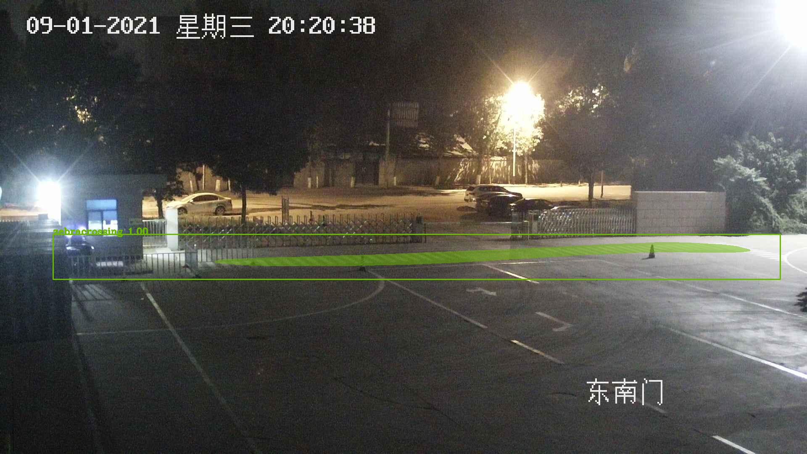

# Mask-Rcnn-Tensorflow-2.0

Now a days tensorflow 2.0 is taking over the world and object detection algorithms are the things in which researchers, students and indutries are intrested alot. So
I decides to make a mask-rcnn compatible with tensorflow 2.0. I took help from alot blogs tensorflow 2.0 documentations and stack-overflow. Now a days its really 
complicated to made a tensorflow code which is compatible with nvidia 3000 series. So I also made some changes to make this code run on my 3070rtx. So tighten your 
seat belts, we are going to start our drive.

# Introduction:
Main Aim of this repository is see if the peditraians are following the road-crossing rules or not. Means if they are walking on zebra-crossing or not.

# Making Dataset.
I took data-frame from one of factory video camera annotate them and than do some training on the annotated images

## Augmentation:

After doing all the annotation things I rotate the image and polygons at every angle (0, 360) you can easily use my notebook to get done with your annotations. Its really complicated to use sin and cos to rotate a point with respect to the image. lol

## Training

After doing the augmentations just give path of the directory where you augmentated the data. If you have done augmentation from the notebook above than your augmentation will probably be on the path where json is located.

You just need to give the augmented images here.

 

## Evaluation

After training you have to open predict notebook. Specify weights path and testing images path and tada your predictions will be their in just few seconds.

**You need to set Generic Config according to train Generic Config and dont forget to give number of classes**

 
 

### Prediction

## Feel free to ask any question Thank you

 
 

# Author 

* Sohaib Anwaar
* gmail          : sohaibanwaar36@gmail.com
* linkedin       : [Have Some Professional Talk here](https://www.linkedin.com/in/sohaib-anwaar-4b7ba1187/)
* Stack Overflow : [Get my help Here](https://stackoverflow.com/users/7959545/sohaib-anwaar)
* Kaggle         : [View my master-pieces here](https://www.kaggle.com/sohaibanwaar1203)